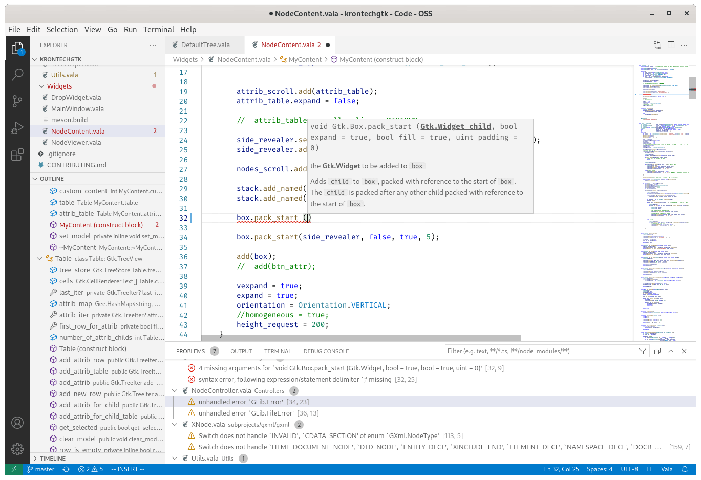
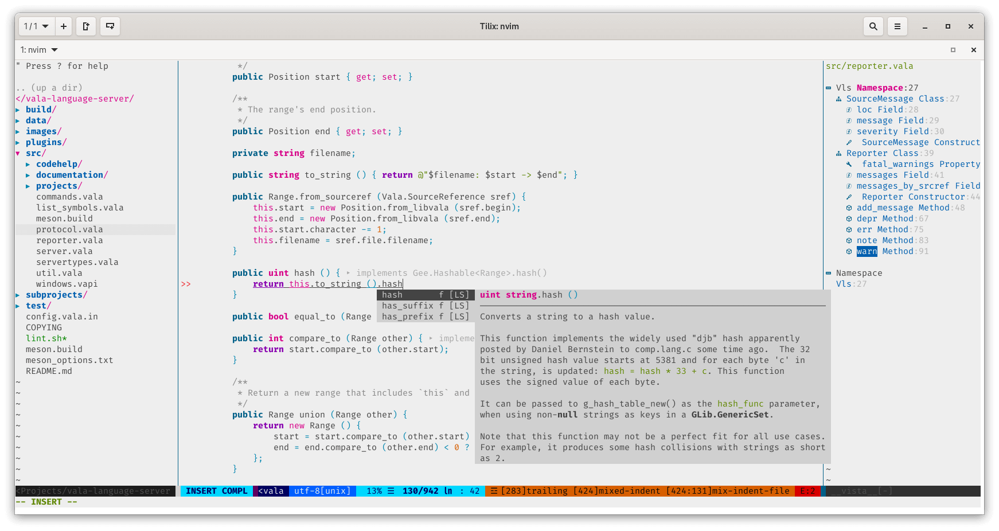
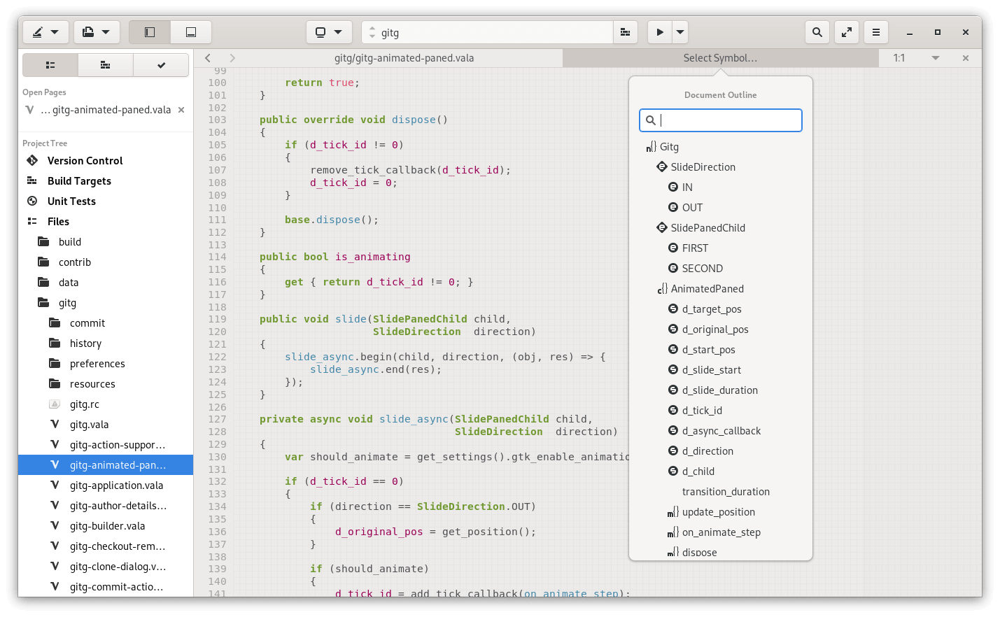

# Vala Language Server

This is a language server for the [Vala programming language](https://vala-project.org).

## Installation

We recommend using VSCode with the [Vala plugin](https://marketplace.visualstudio.com/items?itemName=prince781.vala).

- Arch Linux (via AUR): `yay -S vala-language-server`
  or `yay -S vala-language-server-git`

- Ubuntu, Fedora, Debian, openSUSE, and Mageia: install from [the OBS repo](https://software.opensuse.org//download.html?project=home%3APrince781&package=vala-language-server)

- Alpine Linux: `apk add vala-language-server`

- Guix: `guix install vala-language-server`





## Table of Contents
- [Vala Language Server](#vala-language-server)
  - [Table of Contents](#table-of-contents)
  - [Features](#features)
  - [Dependencies](#dependencies)
  - [Building from Source](#building-from-source)
  - [Editors](#editors)
    - [Vim and Neovim](#vim-and-neovim)
    - [Visual Studio Code](#visual-studio-code)
    - [GNOME Builder](#gnome-builder)
    - [Kate](#kate)
    - [Emacs](#emacs)
  - [Contributing](#contributing)

## Features
- [x] diagnostics
- [x] code completion
    - [x] member access and scope-visible completion
    - [x] context-sensitive suggestions
        - completions for abstract methods/properties to implement
- [x] symbol outline
- [x] goto definition
- [x] symbol references
- [x] goto implementation
- [x] signature help
- [x] hover
- [x] symbol documentation
    - [x] from comments in source code
    - [x] from GIR and VAPI files
- [x] search for symbols in workspace
- [x] highlight active symbol in document
- [x] rename
- [x] snippets
    - for implementing abstract methods/properties
- [x] code lenses
- [ ] code actions
- [ ] code formatting
- [ ] workspaces
- [ ] supported projects
    - [x] meson
    - [x] `compile_commands.json`
    - [x] Vala script (file beginning with `#!/usr/bin/env -S vala` shebang)
    - [ ] cmake
    - [ ] autotools

## Dependencies
- `glib-2.0`
- `gobject-2.0`
- `gio-2.0` and either `gio-unix-2.0` or `gio-windows-2.0`
- `gee-0.8`
- `json-glib-1.0`
- `jsonrpc-glib-1.0 >= 3.28`
- `libvala >= 0.48.12`
- you also need the `posix` VAPI, which should come preinstalled

#### Install dependencies with Guix

If you're using Guix, to launch a shell with build dependencies satisfied:
```sh
guix environment vala-language-server
```

## Building from Source
```sh
meson -Dprefix=/usr/bin build
ninja -C build
sudo ninja -C build install
```

This will install `vala-language-server` to `/usr/bin`

## Editors

**An important note**: VLS cannot know what arguments are used for the file you are editing unless it can locate a build script, compile commands list, or shebang to analyze. (This is generally true for most language servers of compiled languages.) Before making an issue, check whether you have a build script or shebang for your file.

### vim and neovim

#### coc.nvim
1. Make sure [coc.nvim](https://github.com/neoclide/coc.nvim) is installed.
2. After successful installation, in Vim run `:CocConfig` and add a new entry
   for VLS to the `languageserver` property like below:

```json
{
    "languageserver": {
        "vala": {
            "command": "vala-language-server",
            "filetypes": ["vala", "genie"]
        }
    }
}
```

#### vim-lsp
1. Make sure [vim-lsp](https://github.com/prabirshrestha/vim-lsp) is installed
2. Add the following to your `.vimrc`:

```vim
if executable('vala-language-server')
  au User lsp_setup call lsp#register_server({
        \ 'name': 'vala-language-server',
        \ 'cmd': {server_info->[&shell, &shellcmdflag, 'vala-language-server']},
        \ 'whitelist': ['vala', 'genie'],
        \ })
endif
```

### Visual Studio Code
- [Official Vala plugin](https://marketplace.visualstudio.com/items?itemName=prince781.vala)

### GNOME Builder
- requires GNOME Builder >= 3.35
- Running `ninja -C build install` should install the third-party plugin to `$PREFIX/lib/gnome-builder/plugins`. Enable `Vala` and disable `GNOME Vala Language Server`.

### Kate
- officially supported since Kate 21.07.70

### Emacs
- supported with the [lsp-mode](https://github.com/emacs-lsp/lsp-mode) plugin

## Contributing
Want to help out? Here are some helpful resources:

- [Help is wanted on these issues](https://github.com/Prince781/vala-language-server/issues?q=is%3Aissue+is%3Aopen+label%3A%22help+wanted%22)
- [`#vala` on gimpnet/IRC](irc://irc.gnome.org/vala) is for general discussions about Vala and collaboration with upstream
- [Discord server](https://discord.gg/YFAzjSVHt7) is for general discussions about Vala, discussions about this project, and support
- Gitter room is also for project discussions and support, but is less active: https://gitter.im/vala-language-server/community
- Vala wiki: https://wiki.gnome.org/Projects/Vala/
- libvala documentation: https://gnome.pages.gitlab.gnome.org/vala/docs/index.html
